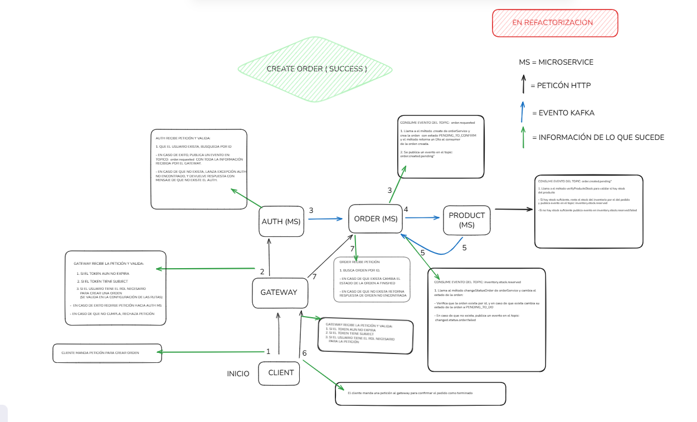
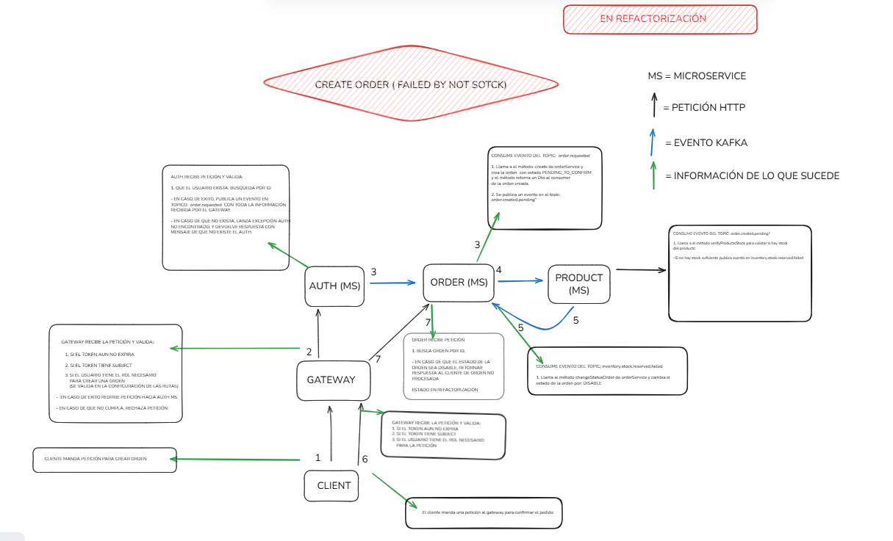

# Sistema de pedidos de alimentos - Microservices Architecture

Arquitectura distribuida basada en microservicios para la gestión de pedidos, usuarios, productos y autenticación, utilizando una coreografía de eventos para mantener la consistencia de datos.

---

## Arquitectura del Sistema
El sistema se compone de microservicios independientes que se comunican de forma asíncrona mediante **Apache Kafka** y se descubren dinámicamente a través de **Netflix Eureka**.

### Componentes Principales
* **API Gateway (Puerto 8080):** Punto de entrada único. Gestiona la seguridad perimetral (JWT) y el enrutamiento.
* **Eureka Server (Puerto 8761):** Registro y descubrimiento de servicios.
* **Auth Service:** Gestión de credenciales, seguridad y generación de tokens.
* **User Service:** Gestión de perfiles y datos personales de usuarios.
* **Product Service:** Catálogo de productos y validación de inventario (Stock).
* **Order Service:** Gestión del ciclo de vida de los pedidos y orquestación con patrón Outbox.

---

## Infraestructura y Despliegue
El proyecto está totalmente dockerizado para facilitar su despliegue local.

### Requisitos Previos
* **Docker & Docker Compose**

### Ejecución del proyecto

* *Descargar el archivo docker-compoe.yaml
* *Descargar el archivo .env.example

  En el archivo .env.example debes cambiar el nombre a  .env
  o crear un nuevo archivo llamado .env y copiar el contenido del original al nuevo.

  Nota 1: La clave JWT en el archivo es un ejemplo y puede usarse para correr el proyecto.
  Nota 2: Tanto el archivo docker-compose.yaml y .env deben estar en el mismo directorio.

 * *Ejecutar el siguiente comando en la ubicacion del archivo docker-compose.yaml: 

```bash
docker-compose up -d
```

* *Se descargaran las imagenes y correran los contenedores automaticamente. (Se cargaran productos y roles automaticamente)
  
Después esperar 30 segundos a que los servicios arranquen.

* *Para conocer las rutas, puedes consultar la documentacion de swagger-ui mas abajo se muestran las direcciones.

---

La ruta base para cualquier peticion es: http://localhost:8080/

Dashboard Eureka: http://localhost:8761

Gateway: http://localhost:8080

Kafka UI: http://localhost:7070

Grafana (Logs): http://localhost:3000 (User: admin / Pass: admin)

* *Documentación API (Swagger):

Order Service: http://localhost:5012/swagger-ui/index.html

Product Service: http://localhost:5013/swagger-ui/index.html

User Service: http://localhost:5011/swagger-ui/index.html

Auth Service: http://localhost:5010/swagger-ui/index.html

---

SERVICIOS

| Servicio | Puerto Externo | Base de Datos |
| :--- | :--- | :--- |
| Gateway | 8080 | - |
| Eureka | 8761 | - |
| Auth MS | 5010 | PostgreSQL (5433) |
| User MS | 5011 | PostgreSQL (5434) |
| Order MS | 5012 | PostgreSQL (5435) |
| Product MS | 5013 | PostgreSQL (5436) |
| Kafka UI | 7070 | - |


## Observabilidad
El ecosistema incluye un stack de monitoreo para trazabilidad distribuida:

* **Loki & Promtail:** Centralización de logs de todos los contenedores.
* **Grafana (Puerto 3000):** Visualización de métricas y logs.
* **Kafka UI:** Interfaz web para monitorear tópicos y mensajes en tiempo real.

---

## Flujo de Eventos (Coreografía)
* **Registro:** `Auth MS` publica en `creating.user` -> `User MS` crea perfil y responde en `creating.user.response`.
* **Pedido:** `Order MS` publica `order.created.pending` -> `Product MS` verifica stock -> Responde `inventory.stock.reserved` o `failed`.
* **Consistencia:** Cada servicio implementa el patrón **Transactional Outbox** e **Idempotencia** para evitar duplicados.

---


## FLUJO ORDEN PROCESADA




## FLUJO ORDEN FALLIDA




